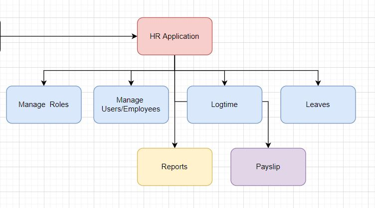
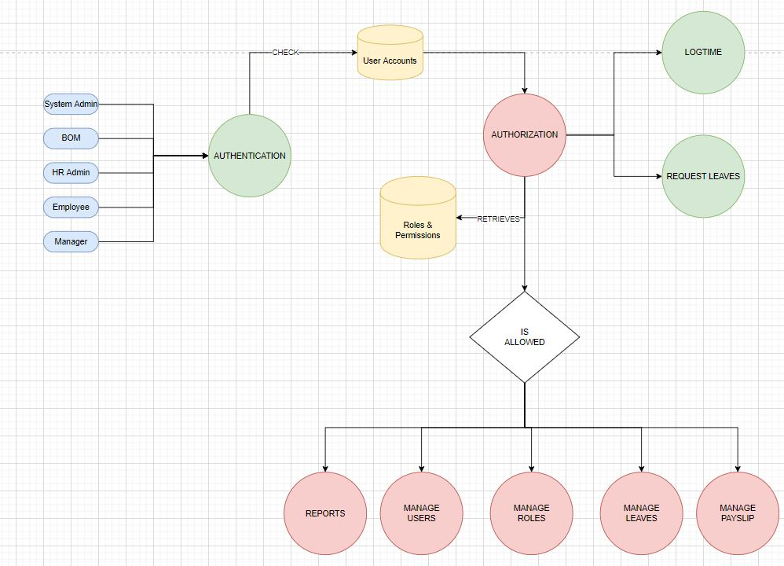

# NestJS Boiler Plate

> Demo Application: Simply HR API

## Main Features

### DFD High Level

#### 1. Actors

> The system will have 5 types of user: BOM, SystemAdmin, HR Admin, Employee, Manager

#### 2. Features

- Ability to manage employees

- Each employee belongs to one/many departments

- Each department has one/many managers

- Ability to log time daily ( employee )

- Ability to submit online leave form

- Ability to accept leave request online

- Allow HR Admin to export timesheet for employees

- Allow HR Admin to send import payslip via an excel file and send a pdf version of payslip to employee's email

- Allow generating report overview for employee's timesheet

- Allow System Admin to setup roles & permissions for users

## Design

## Topics

1. [] Run & Debug
